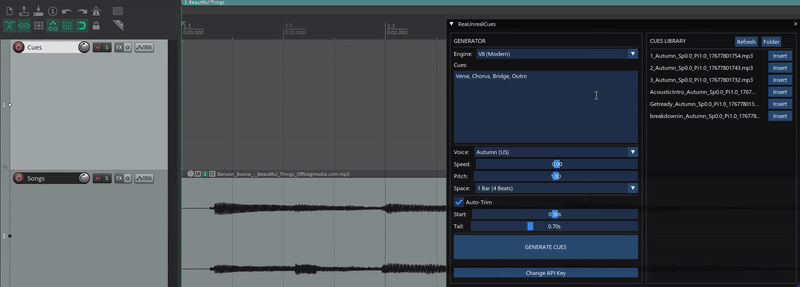

# ReaUnrealCues

**ReaUnrealCues** is a powerful Lua script for **REAPER** that generates high-quality AI text-to-speech cues (count-ins, stage directions, cues) directly onto your timeline using the **Unreal Speech API**.

It is designed for speed and musicality: cues are automatically trimmed, placed on the grid, and organized neatly in your project folder.

## 🚀 Features

* **High-Quality AI Voices:** Access to ultra-realistic Kokoro voices (Scarlett, Dan, Will, Liv, Amy) + multi-language support.
* **Smart Auto-Trim:** Automatically removes leading silence (latency) and trailing silence so cues feel "tight" and punchy immediately.
* **Project Organization:** Automatically saves generated audio files into a `/cues/` subfolder inside your current project media directory.

## 📦 Prerequisites

Before using this script, you need to install **ReaImGui** (for the interface).

1.  Open REAPER.
2.  Go to **Extensions > ReaPack > Browse Packages**.
3.  Search for `ReaImGui` (copy&paste the name!).
4.  Right-click and **Install**.
5.  Click **Apply** to finish.
6.  Restart Reaper

## 🛠️ Installation

1.  Download `ReaUnrealCues.lua` from this repository.
2.  Open REAPER.
3.  Open the **Action List** (`?` key).
4.  Click **New Action > Load ReaScript...**.
5.  Select the `ReaUnrealCues.lua` file you downloaded.

## 🔑 Getting an API Key (Free)

This script uses **Unreal Speech**, which offers an extremely generous free tier (enough for thousands of cues per month).

1.  Go to [UnrealSpeech.com](https://unrealspeech.com/).
2.  Sign up (No credit card required for free tier).
3.  Copy your **API Key** by going to ther dashboard and switching to the dev view.
4.  Paste it into the script when prompted.

*Note: The script stores your key locally in REAPER's ExtState. You can reset it anytime via the "Change API Key" button.*

## 🎛️ Usage

1.  **Select a Track** in REAPER where you want the cues to appear.
2.  **Place Edit Cursor** where you want the first cue to start.
3.  Run the script **ReaUnrealCues**.
4.  **Enter Text:** Type your cues separated by commas (e.g., `Verse, Chorus, Bridge, 1, 2, 3, 4`).
5.  **Select Voice:** Choose from the dropdown (Male/Female, US/UK/CN/ES/etc.).
6.  **Tweak Settings:**
    * **Speed/Pitch:** Adjust to taste.
    * **Spacing:** Choose "1 Beat" (for count-ins) or "1 Bar" (for sections).
7.  Click **GENERATE CUES**.

## ⚙️ Advanced Settings

* **Auto-Trim Silence:** The script removes the first **500ms** of the file (Start Offset) to compensate for API latency, ensuring the word starts exactly on the grid. You can adjust this slider if you find it cuts off the first letter or simply change the item length itself.
* **Tail Trim:** Removes the last **200ms** (default) to keep the items tidy on the timeline.
* **Project Folder:** Ensure your project is **saved** before generating. The script creates a `cues` folder in your media folder.

## 🐛 Troubleshooting

* **"Attempt to call a nil value (ImGui_CreateContext)":** You didn't install ReaImGui. See *Prerequisites*.
* **"Project Not Saved":** You must save your REAPER project at least once so the script knows where to create the `/cues/` folder.
* **File is 1KB / Silent:** Your API Key might be invalid, or you ran out of credits. Check the console for error messages.

## 📄 License

This project is licensed under the MIT License - see the LICENSE file for details.

---
*Not affiliated with Unreal Speech. This is a community tool.*
